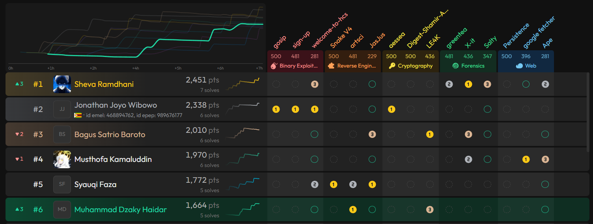

# Heroes Cyber Security (HCS) Internal Selection 2026 - Writeup & Solutions

Repository ini berisi dokumentasi laporan resmi (*writeup*), file soal (*challenges*), gambar pendukung (*figures*), dan script penyelesai (*solvers*) untuk kompetisi **Heroes Cyber Security Internal Selection 2026**.

**Author**: Muhammad Dzaky Haidar (Kazek)

<p align="center">
  
</p>

---

## 📑 Daftar Isi Soal & Flag

| Kategori | Challenge | Tingkat Kesulitan | Flag |
| :--- | :--- | :--- | :--- |
| **Reverse Engineering** | [JasJus](challenges/Reverse%20Engineering/) | Easy | `HCS{$el@M4t_nA8IL_afri2@l_AD41AH_s0$OK_4511_PRes1D3N_84yAN6AN_hcS}` |
| **Reverse Engineering** | [artsci](challenges/Reverse%20Engineering/) | Medium (esolang) | `HCS{3z_3s0l4ng_r3v}` |
| **Cryptography** | [LE4K](challenges/Cryptography/) | Easy | `HCS{L3AK_fr0m_t3mu__771db76a78}` |
| **Web Exploitation** | [Ape](challenges/Web%20Exploitation/) | Easy | `HCS{gH4r0WWwwWWWWWWWwWWwwWWWww_K1ng_g17HuB_6U3_4ku1n_}` |
| **Binary Exploitation** | [welcome-to-hcs](challenges/Binary%20Exploitation/) | Easy | `HCS{g0ddamnNN_YoU_M4de_17_P4ls_533_Y0u_1n_HCS_^^_}` |

---

## 📂 Struktur Direktori

```text
hcs-intersec-2026/
├── challenges/
│   ├── Binary Exploitation/
│   │   ├── challwelcom       # Binary ELF 64-bit
│   │   ├── solva.py          # Exploit solver ret2win (pwntools)
│   │   └── solve.py
│   ├── Cryptography/
│   │   ├── challleak.py      # Source code challenge RSA
│   │   └── leaksolve.py      # Solver RSA akar & faktorisasi n
│   ├── Reverse Engineering/
│   │   ├── chall.js          # JavaScript reverse challenge
│   │   ├── chall.txt         # AsciiDots esolang circuit maze
│   │   └── solverevy.py      # Solver pembalik enkripsi JasJus
│   └── Web Exploitation/
│       └── out/              # Hasil git-dumper repositori target
├── figures/                  # Screenshot dokumentasi, dekompilasi, & terminal
│   ├── ape/
│   ├── artsci/
│   ├── jasjus/
│   ├── le4k/
│   └── welcometohcs/
├── covereadme.png            # Banner / cover readme
├── coverphoto.jpg            # Cover gambar halaman 1
├── template.typ              # Core template Typst CTF writeup
├── main.typ                  # Dokumen sumber writeup Typst
└── Muhammad_Dzaky_Haidar_2025_HCS_INTERSEC_2026.pdf # Laporan terkompilasi
```